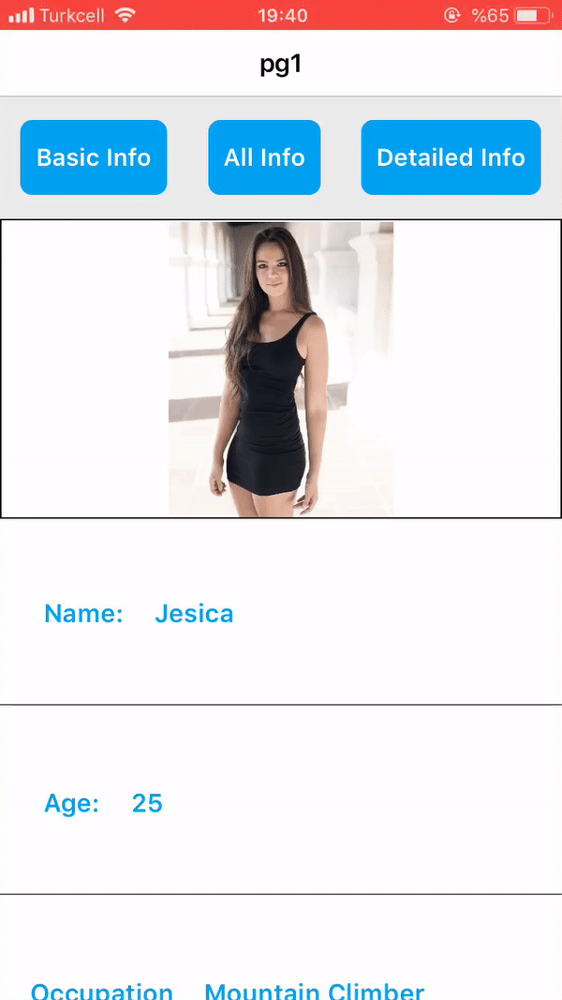

<h3 align="center">
  
</h3>

# Smartface Dynamic ListView

[](https://twitter.com/smartface_io)
[](https://github.com/submetu/Smartface--Dynamic_List_View/blob/master/LICENSE)


## What is this guide about?
* In some projects, you might have a page in which you are using a [`ListView`](http://ref.smartface.io/#!/api/UI.ListView) component.
* The [`ListViewItems`](http://ref.smartface.io/#!/api/UI.ListViewItem) in the `ListView` component might be dynamic.
* By *Dynamic*, I mean that at runtime, you might have to refresh the `ListView` with a completely new set of `ListViewItems`.
* This is a guide will show you how to create such a dynamic `ListView`.

## How to Run the Project
* Fork this project.
* If you have not already done so, make sure that you have added your smartface SSH key in your github account. 
(You can find your smartface SSH key in your [Smartface Account](https://cloud.smartface.io/Account)
* Create a new workspace using the Smartface Cloud Dashboard ( Choose the "Clone from Git" option and use the SSH clone link of your forked project).
* After your workspace has successfully opened, open the integrated terminal using `CTRL + ESC` or go to `View -> Console` in the toolbar of your workspace.
* Navigate to the `/scripts` folder and run `npm install && npm update`.
* Download the latest Smartface Emulator on your smartphone from our [Enterprise Store](http://e.smartface.io).
* Click the *Run on Device* option from the toolbar of your workspace which should open a QR code on your screen.
* Open the Smartface emulator on your smartphone, and scan the QR code.
* You should see the **Smartface Dynamic ListView** application running.


## Application Preview 

<p align="center" >
  <kbd></kbd>
</p>

  
## Walkthrough of the Project
### Overview
* In this application we have a total of 3 **data states**
* These **data states** are determined by a set of instructions that we will see in a while
* The **data states** can be changed by the user by clicking the buttons on the page
### The Entry Point
* In `scripts/app.js`, we define a simple router configuration with a single page `scripts/pages/pg1.js`
### The ListView
* In `pages/pg1`, we are creating a `listView`
* The dynamic nature of the `listView` comes from the `onRowType()` method of the `listView`
* This method returns instructions as to which component to render
* These instructions are based on the index of the `listViewItem`
* The instructions can be found in `scripts/lib/listViewTypes`
### The Instructions (determines the order of the listViewItems)
* First we define all the components in the `listView` and assign a number to it
```javascript
let allTypes = {
    PROFILE: 0,
    PROFILE_INFORMATION: 1,
    PROJECTS: 2,
};
```
* These numbers do not have to be in order but they have to be unique.
* Its now time to define those **data states** 

```javascript
let basicInfo = {
    PROFILE_INFORMATION: 1,
};

let detailedInfo = {
    PROJECTS: 2,
};
```
* These **data states** will be used to show different `listViewItems` on the page.
* The numbers assigned to the individual **data states** ***MUST*** be similar everywhere in this file.

* Next, we define an additional variable. This is the **initial State** of the application.
* This has no particular use in this application, however, you can use this method when you have shared **data states** or when you want to have a static initial **data state**

```javascript
let initialTypes = {
    PROFILE: 0,
};

```
* These **data states** will be manipulated/combined to create a dynamic `listView` back in `scripts/pages/pg1.js`

### First Load

* When you first load the application, the router configuration in `scripts/app.js` redirects you to the page `scripts/pages/pg1.js`
* The following function is called in the `onLoad()` method of the page

```javascript
 page.updateListView({
    listViewType: Object.assign({}, listViewTypes.initialTypes, listViewTypes.basicInfo),
  });
```

* This function assigns the first set of instructions that sets the initial **data states**
* You can pretty much combine the **data states** in whichever way you like. 
* Here I combine the `initialTypes` with the `basicInfo` **data states** 

* After this, we render the `listView` and set events on the buttons.

### Runtime

* At runtime, you can click the buttons on the page. These events are handled in the `setButtonEvents()` function
* In every event handler, we are doing a couple of things
  1. We are passing in new **data states** to the ` updateListView()` function. (Again these can be set as per your needs)
  2. We are refreshing the `listView` so that it can update the `listViewItems` according to the current **data states**

### Nitty Gritty of the ListView

* Since we have different *data states* in our application, we need to let the `listView` know about that
* There are two methods that are aware of these states ( ***STATE AWARE*** )
  1. `listView.onRowCreate()`
  2. `listView.onRowHeight()`
* Note that due to the simplicity of the application, we are not making use of the `listView.onRowBind()` method. In real world applications, you most definitely will be using this method. Therefore, if you are using it, make sure to make this method ***STATE AWARE*** too.
#### `onRowCreate(type)`
* This method takes in the a parameter `type` that is the return value of `listView.onRowType()`
* As discussed previously, `listView.onRowType()` is responsible for the dynamic nature of the `listView`
* Inside `onRowCreate()`, we instantiate different `listViewItems` according to the `type`
* Note that `type` here corresponds to the different ***data states*** 
#### `onRowHeight(index)`
* This method takes in a parameter `index`. This is ***NOT*** the same as the type
* So we run the `getRowType()` function to get the type
* Next, since each `listViewItem` has a different height, according to the ***data state***, we are returning the corresponding height
* The heights here are hardcoded. A better way to do this is to use the class names of the individual `listViewItems` and get the heights using [sf-extension-utils/getCombinedStyle](https://github.com/smartface/sf-extension-utils/blob/master/lib/getCombinedStyle.js)

## Further possible improvements
* If you have any improvements in mind, please open an issue or a pull request

## Contribution
* Contributions are welcome.
### How to contribute?
* Fork the repository
* Follow the instructions in the **How to Run the Project** section
* Create a separate branch and make your changes
* Make sure the test cases below are working
* Compare the way the app works with the **gif** above in the **Application Preview** section
* If everything works fine, commit+push your changes
* Open an [issue](https://github.com/submetu/Smartface--Dynamic_List_View/issues) referencing your commit
* If you create a change that breaks the test cases, and if you think its necessary or an improvement, then make sure to update the [`README.md`](https://github.com/submetu/Smartface--Dynamic_List_View/blob/master/README.md) file

## Test cases
* When the application loads, I should be redirected to `scripts/pages/pg1.js`
* There should be three buttons at the top of the page
* `BASIC INFO` | `ALL INFO` | `DETAILED INFO`
* The app should load with 2 **data states**
    1. PROFILE
    2. PROFILE_INFORMATION
* Clicking on `BASIC INFO` button should update the listview (in the following order) with 
    1. PROFILE
    2. PROFILE_INFORMATION
* Clicking on `ALL INFO` button should update the listview (in the following order) with:
    1. PROFILE
    2. PROFILE_INFORMATION
    3. PROJECT
* Clicking on `DETAILED INFO` button should update the listview (in the following order) with:
    1. PROJECT
 

  


## See Also
- [Smartface E-Commerce App](https://github.com/smartface/sample-sparrow)
- [Smartface Field Service App](https://github.com/smartface/sample-field-service)
- [Smartface Self Service App](https://github.com/smartface/sample-self-service)

## Need Help?

Please [submit an issue](https://github.com/submetu/Smartface--Dynamic_List_View/issues) on GitHub and provide information about your problem.

## Support & Documentation & Useful Links
- [Guides](https://developer.smartface.io)
- [API Docs](http://ref.smartface.io)
- [Smartface Cloud Dashboard](https://cloud.smartface.io)

## Code of Conduct
We are committed to making participation in this project a harassment-free experience for everyone, regardless of the level of experience, gender, gender identity and expression, sexual orientation, disability, personal appearance, body size, race, ethnicity, age, religion, or nationality.
Please read and follow our [Code of Conduct](https://github.com/submetu/Smartface--Dynamic_List_View/blob/master/CODE_OF_CONDUCT.md).

## License

This project is licensed under the terms of the MIT license. See the [LICENSE](LICENSE) file. Within the scope of this license, all modifications to the source code, regardless of the fact that it is used commercially or not, shall be committed as a contribution back to this repository.


